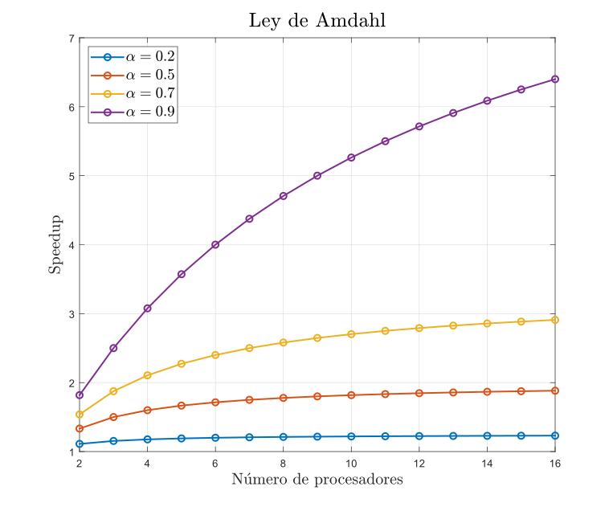

# Métricas de rendimiento

La razón de hacer cómputo en paralelo es mejorar el rendimiento: conseguir un menor tiempo de ejecucución, poder abordar problemas más grandes, manejar conjuntos de datos más grandes, etc. Así que necesitamos un criterio para medir qué tan efectivos son nuestros esfuerzos.

Nos gustaría que un programa paralelo fuera más rápido que su contraparte secuencial en términos de tiempo de ejecución (aunque esto no es algo que podamos garantizar).

La mejora en el tiempo de ejecución se conoce como *speedup* y se define formalmente como:

$$\text{\textit{speedup}} = \frac{t_{seq}}{t_{par}}$$

dónde:

- $t_{seq}$ es el tiempo de ejecución del programa secuencial que toma resolver una instancia del problema.
- $t_{par}$ es el tiempo de ejecución del programa paralelo ue toma resolver la misma instancia del problema.

Como $t_{seq}$ y $t_{par}$ son tiempos medidos de forma real, no representan una medida del todo objetiva, pues son influenciados por diferentes factores:

- La habilidad del programador que escribió las implementaciones.
- El compilador.
- El sistema operativo.
- La hora del día en que se está ejecutando (hay diferentes cargas de trabajo, diferente tráfico de red, etc.).

Para mejorar la confianza al medir el *speedup*, debemos seguir las siguientes reglas:

1. Tanto el programa secuencial como el paralelo deben ejecutarse en el mismo software y hardware y bajo condiciones similares.

2. El programa secuencial debe implementar la solución más rápida conocida al problema.

Los algoritmos paralelos pueden ser completamante diferentes a sus contrapartes secuenciales, de hecho puede pasar que un algoritmo secuencial no tenga un análogo paralelo, o que este sea inviable de crear. Así la razón detrás de la 2da regla regla es fundamnetal: El esfuerzo de crear un programa en paralelo solo se justifica si nos da beneficios tangibles.

En caso de que $\text{\textit{speedup}}>1$, podemos garantizar que es posible obtener una mejora en el rendimiento respecto a la versión secuencial, pero esto no nos dice si es posible hacerlo de forma eficiente, es decir, con una cantidad moderada de recursos. La 2da métrica es empleada para esto, conocida como *eficiencia* (o *efficiency* en inglés) y se define formalmente como:

$$\text{\textit{eficiencia}} = \frac{t_{seq}}{N\cdot t_{par}}= \frac{\text{\textit{speedup}}}{N}$$

dónde

- $N$ es el número de CPUs o núcleos empleados para la ejecución del programa paralelo.

Podemos interpretar podemos interpretar la eficiencia como el porcentaje de tiempo promedio que un nodo es utilizado durante la ejecución paralela. Si la eficiencia es $100%$, significa que $\text{\textit{speedup}}=N$ y la carga de trabajo se divide equitativamente entre todos los procesadores, en este caso el programa paralelo tiene lo que se conoce como *speedup lineal*.

Desafortunadamente este es un escenario ideal, ya que en la realidad los procesadores pasan tiempo coordinándose entre sí, ya sea mediante el paso de mensajes o administrando los recursos compartidos, esto suele reducir el *speedup*.

## Ley de Amdahl

En 1967, Gene Amdahl se dedicó a estudiar una pregunta muy importante: ***¿Qué tanta velocidad podemos ganar al reolver un problema con un programa paralelo?*** Para resolver esta cuestión, Amdahl hizo las siguientes suposiciones:

1. Tenemos una aplicación en secuencial que requiere un tiempo $T$ para ejecutarse en una sola CPU.

2. La aplicación tiene una parte $0\leq\alpha\leq 1$ que puede ejecutarse ejecutarse en paralelo. El resto debe hacerse de forma secuencial.

3. La parte paralela puede dividirse uniformemente entre cualquier número $N$ de CPUs.

Entonces el *speedup* obtenido al usar *N* nodos está acotado superiormente por:

$$\text{\textit{speedup}}_N=\frac{t_{seq}}{t_{par}}=\frac{T}{(1-\alpha)T+\frac{\alpha\cdot T}{N}}=\frac{1}{1-\alpha+\frac{\alpha}{N}}$$

La fórmula anterior es la cota superior ya que estamos ignorando el costo de comunicación o coordinación. Así podemos obtener el *speedup* máximo posible al calcular el límite cuando $N\rightarrow\infty$:

$$\lim_{N\rightarrow\infty}\text{\textit{speedup}}_N=\frac{1}{1-\alpha}$$

En la siguiente gráfica podemos visualizar la **Ley de Amdahl** para diferentes valores $\alpha$:

Podemos ver que incluso para valores muy buenos de $\alpha$, como por ejemplo $\alpha=0.9$, el máximo  valor de *speedup* es bajo, ya que su cota superior es $\frac{1}{1-0.9} = 10$.