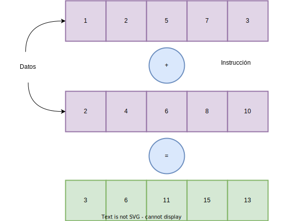

# Taxonomía de Flynn

En 1966, Michael Flynn creó una taxonomía para la describir la arquitectura de computadoras según cuántas secuencias de datos procesan al mismo tiempo y cuántas instrucciones ejecutan simultáneamente. Así tenemos cuatro posibles arquitecturas:

1. **S**ingle **I**nstruction, **S**ingle **D**ata (**SISD**):

En español: *Una sola instrucción, un solo dato*, describe a las máquinas que ejecutan una sola instrucción operando bajo una sola secuencia de datos. Sorprendentemente, la mayoría de las computadoras actuales no pertenecen a esta categoría, ya que tienen una configuración *multicore* (multinúcleo en español), sin embargo, cada uno de esos núcleos puede ser visto como una máquina **SISD**.

2. **S**ingle **I**nstruction, **M**ultiple **D**ata (**SIMD**):

*Una sola instrucción, múltiples datos*. Son máquinas en las que una sola instrucción es aplicada a una colección de varias secuencias de datos. Los procesadores vectoriales siguen este paradigma:

3. **M**ultiple **I**nstructions, **S**ingle **D**ata (**MISD**):

*Múltiples instrucciones, un solo dato*. Aunque puede sonar contraintuitivo aplicar varias instrucciones en simultáneo a una sola secuencia de datos, esta arquitectura es útil en sistemas que necesitan de *tolerancia a fallos* (como aplicaciones militares o aeroespaciales), dónde una secuencia de datos es procesada por varias máquinas y se toman decisiones en conjunto.

4. **M**ultiple **I**nstructions, **M**ultiple **D**ata (**MIMD**):

*Múltiples instrucciones, múltiples datos*. Es el tipo de arquitectura más versátil de toda la taxonomía. Un ejemplo de máquinas que siguen este paradigma pueden ser las CPU's multicore. **MIMD** puede ser separada en dos subcategorías:

- **Memoria compartida**: En esta arquitectura un espacio de memoria universal es compartido. Su mayor problema es que el acceso a la memoria puede convertirse en un cuello de botella que limita la escalabilidad del sistema. Una solución a esto puede ser particionar la memoria y asignarle una parte a cada CPU, que aún puede acceder a **toda** la memoria, solo que accede a su parte de forma más rápida. Este diseño se conoce como **NUMA** (Non-Uniform Memory Access o *acceso a la memoria no uniforme*)

- **Memoria distribuida**: Se basa en procesadores que se comunican mediante el paso de mensajes, aunque dicha comunicación lleva un costo. Algunos tipos son:

    -  Massive Parallel Processors: Son supercomputadoras formadas por CPUs conectadas por redes de alta velocidad.
    - Clusters: Son grupos de computadoras o servidores conectados entre sí y se gestionan como un conjunto.